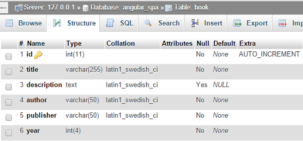
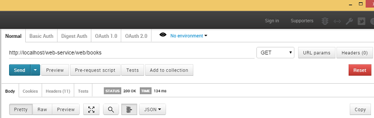

# Creating Web Service

Now that prepartions done we'll start with service part of our application using high performance Yii 2.0 PHP framework.
It's a great fit since it has built in functionality that allows kickstarting with RESTful APIs easily. Basics are already
done for you ensuring many details to be set up correctly while more advanced things could be implemented as needed.

## Create Database Structure

We'll use database named `angular_spa` so create it. Then add `book` table with following structure:



You can use [angular_spa.sql](../web-service/angular_spa.sql) in order to import it.

Insert some data in the table, you can create more tables but for the sake of simplicity, in this tutorial we'll use
only `book`.

## Configure Database Connection

Open [config/db.php](../web-service/config/db.php) in the root of Yii web service application. Modify `db` configuration
to specify your MySQL settings:

```php
return [
    'class' => 'yii\db\Connection',
    'dsn' => 'mysql:host=localhost;dbname=angular_spa',
    'username' => 'root', // specify your username here
    'password' => '', // specify your password here
    'charset' => 'utf8',
];
```

## Create Models

Use Gii to generate model class for database tables (we have only one so far).
[Refer to Yii's guide](http://www.yiiframework.com/doc-2.0/guide-start-gii.html) for details on how to do it.

You should get [models/Book.php](../web-service/models/Book.php) with the following content:
 
```php
namespace app\models;
use Yii;

class Book extends \yii\db\ActiveRecord
{
    public static function tableName()
    {
        return 'book';
    }

    public function rules()
    {
        return [
            [['title', 'author', 'publisher', 'year'], 'required'],
            [['id', 'year'], 'integer'],            
            [['title'], 'string', 'max' => 255],
            [['description'], 'string'],
            [['author','publisher'], 'string', 'max' => 50]
        ];
    }
}
```

## Set up Yii RESTful Application

If you are not familiar with REST support in Yii 2.0, you can get and idea about it by
[reading corresponding guide section](https://github.com/yiisoft/yii2/blob/master/docs/guide/rest-quick-start.md).

### Create REST Controller

There's no ability to generate REST CRUD in Yii's Gii code generator but doing it without it is easy and fun.

First, create [BookController.php](../web-service/controllers/BookController.php) in the `controllers` directory. 
 
```php
namespace app\controllers;

use yii\rest\ActiveController;

class BookController extends ActiveController
{
    // adjust the model class to match your model
    public $modelClass = 'app\models\Book';
    
    public function behaviors()
    {
        return 
        \yii\helpers\ArrayHelper::merge(parent::behaviors(), [
            'corsFilter' => [
                'class' => \yii\filters\Cors::className(),
            ],
        ]);
    }
}
```

The controller class extends from `yii\rest\ActiveController`. By specifying `modelClass` as `app\models\Book`,
the controller knows which model can be used for fetching and manipulating data.

We're adding [CORS behavior](http://www.yiiframework.com/doc-2.0/yii-filters-cors.html) in order to grant access to
third party code (AJAX calls from external domain).
 
If you have more models, create alike controllers for each one.

### Configuring URL Rules

Modify application configuration, `urlManager` component in [web.php](../web-service/config/web.php) in the `config`
directory:

```php
'urlManager' => [
    'enablePrettyUrl' => true,
    'enableStrictParsing' => true,
    'showScriptName' => false,
    'rules' => [
        ['class' => 'yii\rest\UrlRule', 'controller' => 'book'],
    ],
]
```

The above configuration mainly adds a URL rule for the book controller so that the book data can be accessed and
manipulated with pretty URLs and meaningful HTTP verbs. If you have more controllers, specify them as array:

```php

    'rules' => [
        ['class' => 'yii\rest\UrlRule', 'controller' => ['book','user','employee','etc']],
    ],
```

> Note: If you are using Apache as a web server, you need to add a [.htaccess](../web-service/web/.htaccess) file to your
web root. In case of nginx you don't need to do it.

### Enable JSON Input

To let the API accept input data in JSON format, configure the `parsers` property of the `request` application component
to use the `yii\web\JsonParser`:

```php
'request' => [
    'parsers' => [
        'application/json' => 'yii\web\JsonParser',
    ]
]
```

> Info: The above configuration is optional. Without it, the API would only recognize `application/x-www-form-urlencoded`
  and `multipart/form-data` input formats.

## Summary

Not it's time to check what we've created so far with that little effort. We already have RESTful API for getting and
managing book data:

```
GET /books: list all books page by page;
HEAD /books: show the overview information of book listing;
POST /books: create a new book;
GET /books/123: return the details of the book 123;
HEAD /books/123: show the overview information of book 123;
PATCH /books/123 and PUT /books/123: update the book 123;
DELETE /books/123: delete the book 123;
OPTIONS /books: show the supported verbs regarding endpoint /books;
OPTIONS /books/123: show the supported verbs regarding endpoint /books/123.
```

> Info: Yii will automatically pluralize controller names for use in endpoints. You can configure this using the
  `yii\rest\UrlRule::$pluralize`.

You may also access your API via Web browser by entering [http://localhost/web-service/web/books](http://localhost/web-service/web/books).
However, you may need some browser plugins to send specific request headers. For example,
[Postman Chrome Extension](https://chrome.google.com/webstore/detail/postman-rest-client-packa/fhbjgbiflinjbdggehcddcbncdddomop):



---

> [Back To Index](index.md) <br>
> [01. Introduction](01-introduction.md) <br> 
> [02. Preparation](02-preparation.md) <br>
> [03. Create Web Service](03-create-web-service.md) <br>
> [04. Create Web Client](04-create-web-client.md) <br>
> [05. Customization](05-customization.md) <br>
> [06. Conclusion](06-conclusion.md) <br>
