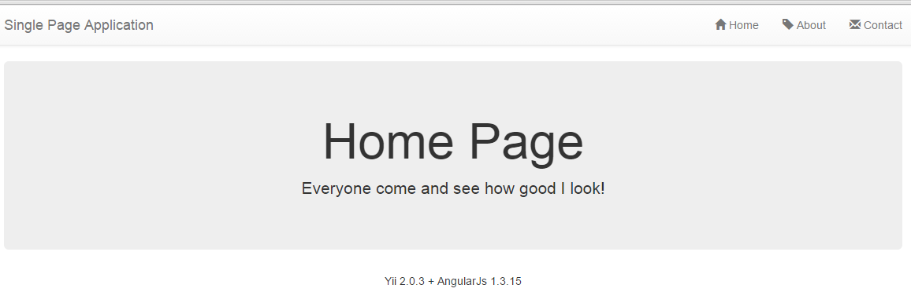
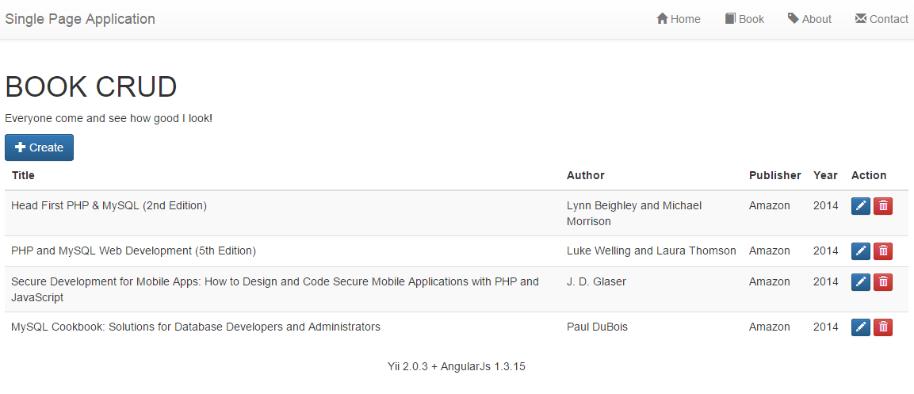

# Creating Web Client

It is time to create a web client or, in other words, the user interface for the application service we've created previously.
We will use AngularJs as JavaScript framework and CSS bootstrap to style our UI.

## Setup Application Entry Script

Entry script is a script that handles all application requests. In our case it will be [index.html](../web-client/index.html)
file contained in the web directory.

### Define Angular App

Add `ng-app` attribute to `html` tag. As an example, we'll use `spaApp` as the value.

```html
<!DOCTYPE html>
<!-- define angular app -->
<html ng-app="spaApp">
<head>
  <!-- CSS -->
```

### Define Default Angular Controller

Add `ng-controller` attribute to `body` tag. Controller name is `index`.

```html
</head>
<!-- define angular controller -->
<body ng-controller="index">
```

### Create Main Menu

Add the following content inside `body` tag:

```html
<body ng-controller="index">
  <nav class="navbar navbar-default">
    <div class="container">
      <div class="navbar-header">
        <a class="navbar-brand" href="#/">Single Page Application</a>
      </div>	  
      <ul class="nav navbar-nav navbar-right">
        <li><a href="#/"><i class="glyphicon glyphicon-home"></i> Home</a></li>
        <li><a href="#/site/about"><i class="glyphicon glyphicon-tag"></i> About</a></li>
        <li><a href="#/site/contact"><i class="glyphicon glyphicon-envelope"></i> Contact</a></li>
      </ul>
    </div>
  </nav>
  <div id="main" class="container"> 
    <!-- angular templating -->
		<!-- this is where content will be injected -->
    <div ng-view></div>    
  </div>
  
  <footer class="text-center">
    <p>Yii 2.0.3 + AngularJs 1.3.15</p>
  </footer> 
```

`Navbar` is used for menu, `main` is page container. `Footer` is, obviously, a footer.

Important thing here is an `id`  of in div with `container` class: 

```html
<div id="main" class="container"> 
  <!-- angular templating -->
	<!-- this is where content will be injected -->
  <div ng-view></div>    
</div>
```

Dynamic content from other files or page views will be placed into `<div ng-view></div>`.

### Create Main Module and Sub Module

The main module is intended to control other scripts such as sub module. We name it [app.js](../web-client/app.js) and
place it into the webroot of the web client:

```js
'use strict';
// adjust to the your url of web service
var serviceBase = 'http://127.0.0.1/web-service/web/'
// declare app level module which depends on views, and components
var spaApp = angular.module('spaApp', [
  'ngRoute',
  'spaApp.site',
]);
// sub module declaration
var spaApp_site = angular.module('spaApp.site', ['ngRoute'])

spaApp.config(['$routeProvider', function($routeProvider) {
  // config default route
  $routeProvider.otherwise({redirectTo: '/site/index'});
}]);
```

Default route is `/site/index`. This route will handled by `spaApp.site` sub module.

### Create Sub Module Definition

After creating `spaApp.site` sub module we need to define what that sub module does. Create a file
[site.js](../web-client/controllers/site.js) in `controllers` directory. 

```js
'use strict';
spaApp_site.config(['$routeProvider', function($routeProvider) {
  $routeProvider
	.when('/site/index', {
		templateUrl: 'views/site/index.html',
		controller: 'index'
	})
	.when('/site/about', {
		templateUrl: 'views/site/about.html',
		controller: 'about'
	})
	.when('/site/contact', {
		templateUrl: 'views/site/contact.html',
		controller: 'contact'
	})
	.otherwise({
		redirectTo: '/site/index'
	});
}])
.controller('index', ['$scope', '$http', function($scope,$http) {
	// create a message to display in our view
	$scope.message = 'Everyone come and see how good I look!';
}])
.controller('about', ['$scope', '$http', function($scope,$http) {
	// create a message to display in our view
	$scope.message = 'Look! I am an about page.';
}])
.controller('contact', ['$scope', '$http', function($scope,$http) {
	// create a message to display in our view
	$scope.message = 'Contact us! JK. This is just a demo.';
}]);
```

This file is sub module to handle site views. It is very similar to Yii's `SiteController`:

```js
spaApp_site.config(['$routeProvider', function($routeProvider) {
  $routeProvider
	.when('/site/index', {
		templateUrl: 'views/site/index.html',
		controller: 'index'
	})
	...
	...
	.otherwise({
		redirectTo: '/site/index'
	});
}])
```

This is routing configuration of this sub module only. Every route has may `templateUrl` and `controller`.

- `templateUrl` is an external HTML file that is used as partial content. Quite similar to Yii views.
- `controller` is a name of controller that prepares template data such as variables. It is simlar to what Yii controller does.

`.otherwise` tells the application what to do if no route matches.

```js
.controller('index', ['$scope', '$http', function($scope,$http) {
	// create a message to display in our view
	$scope.message = 'Everyone come and see how good I look!';
}])
```

`$scope` is a scope that can be handled by the angular app in this case is all the tags under the tag which is marked with ng - app <html ng-app="spaApp">

$scope.message, message is variabel in file templateUrl, let say views/site/index.html, point to {{message}}
 
### Include Main Module and Sub Module

After creating main module `app.js` and sub module `site.js`, we must include it in an entry script of app [index.html](../web-client/index.html):

```html
  <script src="assets/angular/angular-animate.min.js"></script>
  <!-- Include this js -->
  <script src="app.js"></script>
  <script src="controllers/site.js"></script>
</body>
```

### Create Template File

Create a template file to be used by controller in [views](../web-client/views/) directory. The file name would be
[site/index.html](../web-client/views/site/index.html):

```html
<div class="jumbotron text-center">
	<h1>Home Page</h1>
	
	<p>{{ message }}</p>
</div>
```

Create [site/contact.html](../web-client/views/site/contact.html):

```html
<div class="jumbotron text-center">
	<h1>Contact Page</h1>
	
	<p>{{ message }}</p>
</div>
```

Create [site/about.html](../web-client/views/site/about.html):

```html
<div class="jumbotron text-center">
	<h1>About Page</h1>
	
	<p>{{ message }}</p>
</div>
```

These views are simple placeholders for now.
 
### Test your application

[http://localhost/web-client](http://localhost/web-client)<br>

 
### Modify app.js

Add global JavaScript varable `serviceBase` that refers to your Yii 2.0 web service. Then add a sub module called `spaApp.book`:

```js
'use strict';
var serviceBase = 'http://127.0.0.1/web-service/web/'
// Declare app level module which depends on views, and components
var spaApp = angular.module('spaApp', [
  'ngRoute',
  'spaApp.site',
  'spaApp.book',
]);
var spaApp_site = angular.module('spaApp.site', ['ngRoute'])
var spaApp_book = angular.module('spaApp.book', ['ngRoute']);

spaApp.config(['$routeProvider', function($routeProvider) {
  $routeProvider.otherwise({redirectTo: '/site/index'});
}]); 
```

### Create [book.js](../web-client/models/book.js) in `models` directory

`book.js` will handle CRUD data provided by REST service is is pretty much what models are doing in Yii.

```js
'use strict';
spaApp_book.factory("services", ['$http','$location','$route', 
	function($http,$location,$route) {
    var obj = {};
    obj.getBooks = function(){
        return $http.get(serviceBase + 'books');
    }	
	obj.createBook = function (book) {
		return $http.post( serviceBase + 'books', book )
			.then( successHandler )
			.catch( errorHandler );
		function successHandler( result ) {
			$location.path('/book/index');			
		}
		function errorHandler( result ){
			alert("Error data")
			$location.path('/book/create')
		}
	};	
	obj.getBook = function(bookID){
        return $http.get(serviceBase + 'books/' + bookID);
    }
	
	obj.updateBook = function (book) {
	    return $http.put(serviceBase + 'books/' + book.id, book )
			.then( successHandler )
			.catch( errorHandler );
		function successHandler( result ) {
			$location.path('/book/index');
		}
		function errorHandler( result ){
			alert("Error data")
			$location.path('/book/update/' + book.id)
		}	
	};	
	obj.deleteBook = function (bookID) {
	    return $http.delete(serviceBase + 'books/' + bookID)
			.then( successHandler )
			.catch( errorHandler );
		function successHandler( result ) {
			$route.reload();
		}
		function errorHandler( result ){
			alert("Error data")
			$route.reload();
		}	
	};	
    return obj;   
}]);
```

There are multiple functions such as `obj.getBooks`, `obj.createBook`, etc. which are passing data to RESTful endpoints. 
For example, the following will get a list of the books using GET.
See [this guide](https://github.com/yiisoft/yii2/blob/master/docs/guide/rest-quick-start.md#trying-it-out-). 
 
```js
obj.getBooks = function(){
        return $http.get(serviceBase + 'books');
    }
```

Create a book using POST:

```js
obj.createBook = function (book) {
		return $http.post( serviceBase + 'books', book )
```

Update a book using PUT:

```js
obj.updateBook = function (book) {
	    return $http.put(serviceBase + 'books/' + book.id, book )
```

### Create a controller for `Site` Sub Module

Create [book.js](../web-client/controllers/book.js) in `controllers` directory. It will handle book views like Yii controller
does:

```js
'use strict';
spaApp_book.config(['$routeProvider', function($routeProvider) {
  $routeProvider
	.when('/book/index', {
		templateUrl: 'views/book/index.html',
		controller: 'index'
	})
	.when('/book/create', {
		templateUrl: 'views/book/create.html',
		controller: 'create',
		resolve: {
			book: function(services, $route){
				return services.getBooks();
			}
        }
	})
	.when('/book/update/:bookId', {
		templateUrl: 'views/book/update.html',
		controller: 'update',
		resolve: {
          book: function(services, $route){
            var bookId = $route.current.params.bookId;
            return services.getBook(bookId);
          }
        }
	})
	.when('/book/delete/:bookId', {
		templateUrl: 'views/book/index.html',
		controller: 'delete',
	})
	.otherwise({
		redirectTo: '/book/index'
	});
}]);

spaApp_book.controller('index', ['$scope', '$http', 'services', 
	function($scope,$http,services) {
	$scope.message = 'Everyone come and see how good I look!';
	services.getBooks().then(function(data){
        $scope.books = data.data;
    });	
	$scope.deleteBook = function(bookID) {
		if(confirm("Are you sure to delete book number: " + bookID)==true && bookID>0){
			services.deleteBook(bookID);	
			$route.reload();
		}
	};
}])
.controller('create', ['$scope', '$http', 'services','$location','book', 
	function($scope,$http,services,$location,book) {
	$scope.message = 'Look! I am an about page.';
	$scope.createBook = function(book) {
        var results = services.createBook(book);
    }  
}])
.controller('update', ['$scope', '$http', '$routeParams', 'services','$location','book', 
	function($scope,$http,$routeParams,services,$location,book) {
	$scope.message = 'Contact us! JK. This is just a demo.';
	var original = book.data;
	$scope.book = angular.copy(original);
	$scope.isClean = function() {
		return angular.equals(original, $scope.book);
	}
	$scope.updateBook = function(book) {	
        var results = services.updateBook(book);
    } 
}]);
```

### Create Template File for Book Sub Module

Create template file that is pointed by controller in `book` sub module in [views](../web-client/views/) directory.
The name is [book/index.html](../web-client/views/book/index.html):

```html
<div>
	<h1>BOOK CRUD</h1>	
	<p>{{ message }}</p>
	<div ng-show="books.length > 0">
	<a class="btn btn-primary" href="#/book/create">
		<i class="glyphicon glyphicon-plus"></i> Create
	</a>
	<table class="table table-striped table-hover">
	<thead>
	<th>Title</th>
	<th>Author</th>
	<th>Publisher</th>
	<th>Year</th>
	<th style="width:80px;">Action&nbsp;</th>
	</thead>
	<tbody>
		<tr ng-repeat="data in books">
			<td>{{data.title}}</td>
			<td>{{data.author}}</td>
			<td>{{data.publisher}}</td>
			<td>{{data.year}}</td>
			<td>
			<a class="btn btn-primary btn-xs" href="#/book/update/{{data.id}}">
				<i class="glyphicon glyphicon-pencil"></i>
			</a> 
			<a class="btn btn-danger btn-xs" ng-click="deleteBook(data.id)">
				<i class="glyphicon glyphicon-trash"></i>
			</a>
			</td>
		</tr>
	</tbody>
	</table>
	</div>
	<div ng-show="books.length == 0">
		Empty
	</div>
</div>
```
Create [book/create.html](../web-client/views/book/create.html):

```html
<div>
	<h1>BOOK CRUD</h1>
	
	<p>{{ message }}</p>
	<form role="form" name="myForm">
		<div class= "form-group" ng-class="{error: myForm.title.$invalid}">
			<label> Title </label>
			<div>
			<input name="title" ng-model="book.title" type= "text" class= "form-control" placeholder="Title" required/>
			<span ng-show="myForm.title.$dirty && myForm.title.$invalid" class="help-inline">Title Required</span>
			</div>
		</div>
		<div class= "form-group">
			<label> Description </label>
			<div>
			<textarea name="description" ng-model="book.description" class= "form-control" placeholder= "Description"></textarea>
			</div>
		</div>
		<div class= "form-group" ng-class="{error: myForm.author.$invalid}">
			<label> Author </label>
			<div>
			<input name="author" ng-model="book.author" type= "text" class= "form-control" placeholder="Author" required/>
			<span ng-show="myForm.author.$dirty && myForm.author.$invalid" class="help-inline">Author Required</span>
			</div>
		</div>
		<div class= "form-group" ng-class="{error: myForm.publisher.$invalid}">
			<label> Publisher </label>
			<div>
			<input name="publisher" ng-model="book.publisher" type= "text" class= "form-control" placeholder="Publisher" required/>
			<span ng-show="myForm.publisher.$dirty && myForm.publisher.$invalid" class="help-inline">Publisher Required</span>
			</div>
		</div>
		<div class= "form-group" ng-class="{error: myForm.year.$invalid}">
			<label> Year </label>
			<div>
			<input name="year" ng-model="book.year" type= "text" class= "form-control" placeholder="Year" required/>
			<span ng-show="myForm.year.$dirty && myForm.year.$invalid" class="help-inline">Year Required</span>
			</div>
		</div>
	  
		<a href="#/book/index" class="btn btn-default">Cancel</a>
		<button ng-click="createBook(book);" 
                ng-disabled="myForm.$invalid"
                type="submit" class="btn btn-default">Submit</button>
	</form>
</div>
```

Create [book/update.html](../web-client/views/book/update.html):

```html
<div>
	<h1>BOOK CRUD</h1>
	
	<p>{{ message }}</p>
	<form role="form" name="myForm">
		<div class= "form-group" ng-class="{error: myForm.title.$invalid}">
			<label> Title </label>
			<div>
			<input name="title" ng-model="book.title" type= "text" class= "form-control" placeholder="Title" required/>
			<span ng-show="myForm.title.$dirty && myForm.title.$invalid" class="help-inline">Title Required</span>
			</div>
		</div>
		<div class= "form-group">
			<label> Description </label>
			<div>
			<textarea name="description" ng-model="book.description" class= "form-control" placeholder= "Description"></textarea>
			</div>
		</div>
		<div class= "form-group" ng-class="{error: myForm.author.$invalid}">
			<label> Author </label>
			<div>
			<input name="author" ng-model="book.author" type= "text" class= "form-control" placeholder="Author" required/>
			<span ng-show="myForm.author.$dirty && myForm.author.$invalid" class="help-inline">Author Required</span>
			</div>
		</div>
		<div class= "form-group" ng-class="{error: myForm.publisher.$invalid}">
			<label> Publisher </label>
			<div>
			<input name="publisher" ng-model="book.publisher" type= "text" class= "form-control" placeholder="Publisher" required/>
			<span ng-show="myForm.publisher.$dirty && myForm.publisher.$invalid" class="help-inline">Publisher Required</span>
			</div>
		</div>
		<div class= "form-group" ng-class="{error: myForm.year.$invalid}">
			<label> Year </label>
			<div>
			<input name="year" ng-model="book.year" type= "text" class= "form-control" placeholder="Year" required/>
			<span ng-show="myForm.year.$dirty && myForm.year.$invalid" class="help-inline">Year Required</span>
			</div>
		</div>
	  
		<a href="#/book/index" class="btn btn-default">Cancel</a> 
		<button ng-click="updateBook(book);" 
                ng-disabled="isClean() || myForm.$invalid"
                type="submit" class="btn btn-default">Submit</button>
	</form>
</div>
```

### Modify Main Menu
Don't forget to add link to book CRUD.
```html
<li><a href="#/book/index"><i class="glyphicon glyphicon-book"></i> Book</a></li>
```

### Test it
 


---

> [Back To Index](index.md) <br>
> [01. Introduction](01-introduction.md) <br> 
> [02. Preparation](02-preparation.md) <br>
> [03. Create Web Service](03-create-web-service.md) <br>
> [04. Create Web Client](04-create-web-client.md) <br>
> [05. Customization](05-customization.md) <br>
> [06. Conclusion](06-conclusion.md) <br>
